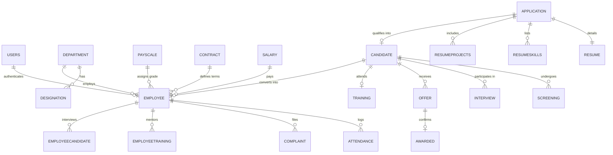

# ⚡ HireFlow — Cloud-Native HR Recruitment & Employee Lifecycle Management System

<div align="center">

[](https://reactjs.org/)
[](https://nodejs.org/)
[](https://www.mysql.com/)
[](https://aws.amazon.com/ec2/)
[](https://aws.amazon.com/s3/)
[](https://nginx.org/)
[](LICENSE)

**A full-stack, enterprise-grade Human Resource Management and Recruitment Platform designed to automate the entire "Hire-to-Retire" lifecycle. Engineered with a normalized 20-table MySQL relational database, zero-credential AWS S3 document ingestion via IAM Instance Profiles, and automated single-click AWS EC2 production deployment.**

[Key Features](#-key-features) • [System Architecture](#-system-architecture) • [Database Schema](#-database-schema--relational-design) • [Quick Start](#-getting-started-locally) • [AWS Cloud Deployment](#-aws-cloud-deployment) • [API Reference](#-api-endpoints-reference)

</div>

---

## 📌 Executive Summary

Organizations often struggle with fragmented talent pipelines: resumes get lost in inboxes, interview feedbacks are unstandardized, and onboarding data is manually re-entered into payroll spreadsheets. 

**HireFlow** solves this by providing a unified, auditable, and automated platform:
1. **Public Intake**: Prospective candidates submit credentials and upload CVs directly to high-durability cloud object storage (AWS S3).
2. **HR Talent Funnel**: Candidates are filtered through Screening, structured Interview rounds with employee scorecards, and automated Offer generation.
3. **Automated Conversion**: Hired candidates are transitioned into full-time Employees via atomic SQL transactions, instantly binding them to department hierarchies, payscale grades, and contract terms.
4. **Post-Hire Operations**: Manages daily biometric-style attendance logging, dynamic payroll slip calculations (HRA, DA, Allowances), and internal employee grievance redressals.

---

## ✨ Key Features

### 🎯 1. End-to-End Talent Acquisition Pipeline
- **Public Career Portal**: Clean, modern job application form allowing applicants to select preferred roles, enter qualifications/experience, and attach PDF/Word resumes.
- **Screening & Shortlisting**: HR dashboard to evaluate incoming applications and qualify applicants into the candidate talent pool.
- **Structured Interviewing**: Assign internal employee interviewers, track interview schedules, record scores, and document outcomes (`Scheduled`, `Passed`, `Failed`, `Cancelled`).
- **Formal Offer Management**: Generate standardized employment offers linked to contract notice periods and compensation structures.
- **Training & Mentorship**: Assign employee mentors to ongoing trainee candidates with milestone tracking and progress feedback.

### 👥 2. Organizational & Employee Governance
- **Atomic Employee Hiring**: Single-click conversion from accepted offer/training candidate to full-time active Employee with automated join date, department assignment, and designation linking.
- **Department & Vacancy Tracking**: Real-time headcount calculations and vacancy management across organizational departments.
- **Employee Self-Service (ESS) Portal**: Dedicated portal for active employees to review compensation slips, inspect attendance logs, and lodge workplace grievances.

### 💰 3. Dynamic Payscale & Payroll Architecture
- **Payscale Grade Matrix**: Configurable pay grades (`Grade A` to `Grade E`) with automated component breakdowns: Base Salary, House Rent Allowance (HRA), Dearness Allowance (DA), and miscellaneous allowances.
- **Dynamic Salary Calculation**: Real-time gross and net salary computations.
- **Interactive Department Expenditure Analytics**: Filter and aggregate total/average payroll expenses across specific departments on-the-fly.

### 📊 4. SQL Analytics & Real-Time Business Intelligence
- **Multi-Table Relational JOINs**: Complex 4-table database queries combining `employee`, `department`, `designation`, and `application` records.
- **Aggregations & Statistical Metrics**: Real-time calculations of `SUM`, `AVG`, `MAX`, `MIN` across organizational expenditure, candidate conversion rates, and department headcounts.
- **Live Recruitment Funnel**: Visual distribution metrics tracking applicants from initial submission to active employment.

### 🛡️ 5. Enterprise Security & Cloud Engineering
- **Zero-Hardcoded Secrets**: Uses AWS IAM Instance Profiles (`@aws-sdk/client-s3`) on EC2 to fetch short-lived STS metadata credentials automatically.
- **Role-Based Access Control (RBAC)**: Secure separation between HR Administrators (`/hr`) and Active Employees (`/employee`).
- **Cryptographic Security**: Passwords hashed with `bcryptjs` (salt rounds: 10) and session authorization via JSON Web Tokens (JWT).
- **Hardened HTTP Layer**: Security headers via `Helmet.js`, CORS origin restriction, and request rate limiting.

---

## 🏛️ System Architecture

HireFlow is engineered as a decoupled, multi-tier cloud-native web application:

```
                                      INTERNET
                                          │
                                          ▼ [HTTP Traffic :80 / HTTPS :443]
                            ┌───────────────────────────────┐
                            │   AWS Security Group          │
                            │   (Inbound: 22 SSH, 80 HTTP)  │
                            └──────────────┬────────────────┘
                                           │
                                           ▼
                            ┌───────────────────────────────┐
                            │     AWS EC2 Instance          │
                            │    (Ubuntu Linux / Swap 2G)   │
                            │                               │
                            │  ┌─────────────────────────┐  │
                            │  │      Nginx (Port 80)    │  │ ──► Serves React SPA Production Build
                            │  └───────────┬─────────────┘  │
                            │              │ (Reverse Proxy: /api/*)
                            │  ┌───────────▼─────────────┐  │
                            │  │  Node.js API (Port 5000)│  │ ──► Managed by PM2 Cluster (/backend)
                            │  └─────┬─────────────┬─────┘  │
                            │        │             │        │
                            │        ▼             │        │
                            │    MySQL Server      │        │
                            │ (hr_recruitment_db)  │        │
                            │  20 Relational Tables│        │
                            └──────────────────────┼────────┘
                                                   │
                                                   │ AWS SDK v3 (@aws-sdk/client-s3)
                                                   │ IAM Instance Profile (Zero Hardcoded Keys)
                                                   ▼
                                    ┌───────────────────────────────┐
                                    │     AWS S3 Bucket             │
                                    │   (hr-proj-resume)            │
                                    │   Region: ap-south-1 (Mumbai) │
                                    │   Candidate Resume Storage    │
                                    └───────────────────────────────┘
```

---

## 🗄️ Database Schema & Relational Design

The system is backed by a normalized **20-table MySQL relational database** enforcing strict primary/foreign key constraints, referential integrity, and cascading behaviors:



### Table Summary Breakdown:
| Table Name | Description | Key Relationships |
| :--- | :--- | :--- |
| `users` | User credentials, roles (`hr`, `employee`), and auth metadata | Links to `employee.EmployeeID` |
| `department` | Organizational divisions, vacancies, and performance | 1-to-Many with `designation` & `employee` |
| `designation` | Job titles and department-specific openings | Foreign key to `department` |
| `payscale` | Grade definitions (`A`-`E`) with Base, HRA, DA, Others | Foreign key to `employee` |
| `salary` | Historical and active salary disbursements | Foreign key to `offer` & `employee` |
| `contract` | Employment contract durations and notice periods | Foreign key to `offer` & `employee` |
| `application` | Intake submissions and S3 resume URLs | 1-to-1 with `resume`, 1-to-Many with skills |
| `resume` / `resumeskills` / `resumeprojects` | Candidate qualifications, experience, and project portfolios | Cascading Foreign Key to `application` |
| `candidate` | Qualified talent pool with expected salary and potential rating | Foreign key to `application` |
| `screening` | HR initial evaluation records and status | Foreign keys to `application` & `candidate` |
| `interview` | Scheduled rounds, times, venues, and pass/fail states | Foreign key to `candidate` |
| `offer` / `awarded` | Formal compensation offers and acceptance timestamps | Foreign keys to `candidate`, `salary`, `contract` |
| `training` / `employeetraining` | Trainee milestones, insights, and assigned mentors | Foreign keys to `candidate` & `employee` |
| `employee` | Central full-time employee master record | Relational anchor for organizational data |
| `attendance` | Daily check-in/out timestamps and leave logs | Foreign key to `employee` |
| `complaint` | Grievance redressal tickets, priorities, and status | Foreign key to `employee` |

---

## 🛠️ Technology Stack

| Layer | Technologies |
| :--- | :--- |
| **Frontend** | React 18, React Router v6, Axios, React Hot Toast, Modern Glassmorphic CSS3 |
| **Backend** | Node.js, Express.js, JSON Web Tokens (JWT), Multer, Helmet, Rate Limiter |
| **Database** | MySQL 8.0+ (InnoDB Engine, ACID Transactions, Foreign Key Constraints) |
| **Cloud & DevOps** | AWS EC2 (`t2.micro`/`t3.micro`), AWS S3, AWS IAM Roles, Nginx, PM2 |
| **SDKs & Libraries** | `@aws-sdk/client-s3`, `mysql2/promise`, `bcryptjs` |

---

## 🚀 Getting Started Locally

### Prerequisites
- [Node.js](https://nodejs.org/) (v16.x or higher)
- [MySQL Server](https://dev.mysql.com/downloads/mysql/) (v8.0 or higher)
- Git

---

### 1. Database Initialization
1. Open your MySQL client (Terminal or MySQL Workbench) and create the database:
   ```sql
   CREATE DATABASE hr_recruitment_db;
   ```
2. Import the canonical relational schema:
   ```bash
   mysql -u root -p hr_recruitment_db < database/schema.sql
   ```
3. Populate complete end-to-end demo lifecycle data:
   ```bash
   cd backend
   node seeder.js
   ```

---

### 2. Backend Setup
1. Navigate to the `backend/` directory:
   ```bash
   cd backend
   ```
2. Copy the environment configuration template:
   ```bash
   cp .env.example .env
   ```
3. Open `.env` and configure your local MySQL credentials:
   ```env
   PORT=5000
   DB_HOST=localhost
   DB_PORT=3306
   DB_USER=root
   DB_PASSWORD=your_mysql_password
   DB_NAME=hr_recruitment_db
   JWT_SECRET=super_secret_jwt_key_for_development
   ```
4. Install dependencies and start the backend server:
   ```bash
   npm install
   npm start
   # Server running at http://localhost:5000
   ```

---

### 3. Frontend Setup
1. In a new terminal window, navigate to the `frontend/` directory:
   ```bash
   cd frontend
   ```
2. Install dependencies:
   ```bash
   npm install
   ```
3. Start the React development server:
   ```bash
   npm start
   # Client running at http://localhost:3000
   ```

---

## 🔑 Default Demo Credentials

The database seeder provisions standard test accounts for instant evaluation:

| Role | Username | Password | Accessible Portals & Features |
| :--- | :--- | :--- | :--- |
| **HR Administrator** | `admin` | `admin123` | Full HR Management Console (`/hr`), Funnel, Hiring, Payroll, Analytics |
| **Active Employee** | `eva` | `user123` | Employee Self-Service (`/employee`), Payslips, Attendance, Grievances |
| **Active Employee** | `diana` | `user123` | Employee Self-Service (`/employee`), Payslips, Attendance, Grievances |

---

## ☁️ AWS Cloud Deployment

This project includes a production-ready automated provisioning script (`setup_ec2.sh`) to deploy the complete stack onto an **AWS EC2 instance**.

### Architecture & Resource Optimization:
- **Compute**: AWS EC2 instance (`t2.micro`, `t3.micro`, or standard production instance).
- **Swap Memory**: Automatically configures a **2GB Linux swap space** (`/swapfile`) for optimal memory headroom during production builds and heavy queries.
- **Cloud Storage**: AWS S3 with IAM Instance Profile authentication (`hr-ec2-s3-role`), eliminating hardcoded API keys.
- **Web Server & Reverse Proxy**: Nginx forwards `/api/*` to Express on port 5000 and serves optimized static React builds.
- **Process Manager**: PM2 daemonizes the Node.js backend with auto-restart on system reboots.

### Deployment Steps:
1. **Launch EC2 Instance**:
   - **AMI**: Ubuntu 24.04 LTS or 22.04 LTS
   - **Instance Type**: `t2.micro` / `t3.micro` (or production size of choice)
   - **Storage**: 20 GB gp3 General Purpose SSD
   - **Security Group**: Allow Port 22 (SSH) and Port 80 (HTTP)
   - **IAM Role**: Attach an IAM Role with `AmazonS3FullAccess` to your instance.

2. **Connect & Clone**:
   ```bash
   ssh -i "your-key.pem" ubuntu@<YOUR_EC2_PUBLIC_IP>
   git clone https://github.com/Arshit-dv/HireFlow.git /home/ubuntu/app
   cd /home/ubuntu/app
   ```

3. **Run Automated One-Click Provisioning**:
   ```bash
   chmod +x setup_ec2.sh
   ./setup_ec2.sh
   ```

---

## 📡 API Endpoints Reference

### 🔐 Authentication & Session
| Method | Endpoint | Description | Access |
| :--- | :--- | :--- | :--- |
| `POST` | `/api/auth/login` | Authenticate user & issue JWT token | Public |
| `POST` | `/api/auth/register` | Register new user account | Public |
| `GET` | `/api/auth/me` | Fetch authenticated session profile | Authenticated |

### 📝 Applications & Talent Ingestion
| Method | Endpoint | Description | Access |
| :--- | :--- | :--- | :--- |
| `POST` | `/api/applications` | Submit public job application with resume | Public |
| `GET` | `/api/applications` | Fetch all received applications | HR Only |
| `POST` | `/api/applications/:id/convert` | Promote application to Candidate | HR Only |
| `DELETE` | `/api/applications/:id` | Remove application record | HR Only |

### 👥 Candidate & Pipeline Operations
| Method | Endpoint | Description | Access |
| :--- | :--- | :--- | :--- |
| `GET` | `/api/candidates` | List candidates with status & ratings | HR Only |
| `POST` | `/api/interviews` | Schedule candidate interview round | HR Only |
| `PUT` | `/api/interviews/:id` | Update interview result (`Passed`/`Failed`) | HR Only |
| `POST` | `/api/offers` | Generate formal offer letter | HR Only |
| `PUT` | `/api/offers/:id/accept` | Record offer acceptance | HR Only |
| `POST` | `/api/training` | Assign onboarding training milestones | HR Only |
| `POST` | `/api/employees/hire` | Atomic transaction to hire candidate into Employee | HR Only |

### 💼 HR & Employee Operations
| Method | Endpoint | Description | Access |
| :--- | :--- | :--- | :--- |
| `GET` | `/api/employees` | List active employees and department hierarchy | HR / Authenticated |
| `GET` | `/api/salaries` | Generate salary slips and payscale breakdowns | HR Only |
| `GET` | `/api/attendance` | Fetch biometric check-in & attendance history | Authenticated |
| `POST` | `/api/attendance` | Log daily attendance check-in | Employee / HR |
| `GET` | `/api/complaints` | Fetch grievance ticket log | Authenticated |
| `POST` | `/api/complaints` | Submit workplace grievance ticket | Employee |
| `GET` | `/api/analytics` | Execute multi-table SQL queries & aggregations | HR Only |

---

## 📂 Project Structure

```
HireFlow/
├── backend/                        # Express.js REST API Server
│   ├── config/                     # MySQL pool & AWS S3 SDK configuration
│   │   ├── db.js                   # mysql2 connection pool
│   │   └── s3.js                   # AWS S3 client & IAM instance credential resolver
│   ├── controllers/                # Business logic & SQL query execution
│   │   ├── analyticsController.js  # Relational JOINs & statistical aggregations
│   │   ├── applicationController.js# Application intake & resume uploads
│   │   ├── attendanceController.js # Attendance logging
│   │   ├── authController.js       # JWT & Bcrypt authentication
│   │   ├── candidateController.js  # Candidate lifecycle
│   │   ├── complaintController.js  # Grievance handling
│   │   ├── departmentController.js # Departments & designations
│   │   ├── employeeController.js   # Employee hiring & records
│   │   ├── interviewController.js  # Interview scheduling
│   │   ├── offerController.js      # Offer letter management
│   │   ├── salaryController.js     # Payroll calculations
│   │   └── trainingController.js   # Training program tracking
│   ├── middleware/                 # JWT Auth & error handling middlewares
│   ├── routes/                     # REST API route declarations
│   ├── .env.example                # Environment variable blueprint
│   ├── package.json                # Backend dependencies
│   ├── seeder.js                   # Comprehensive database seeder script
│   └── server.js                   # Express application entrypoint
├── database/                       # Database DDL & Schema Scripts
│   ├── schema.sql                  # Canonical 20-table relational schema & seed
│   ├── create_db.sql               # Database setup mirror
│   └── create_users.sql            # Dedicated DB users setup
├── frontend/                       # React.js Single Page Application
│   ├── public/                     # Static HTML & icons
│   ├── src/
│   │   ├── components/             # Reusable UI components (Sidebar, Modals, Nav)
│   │   ├── context/                # Global Authentication context (JWT state)
│   │   ├── pages/                  # Application views & dashboards
│   │   │   ├── Analytics.jsx       # SQL Analytics & multi-table reports
│   │   │   ├── Applications.jsx    # Applications intake dashboard
│   │   │   ├── Apply.jsx           # Public job application form
│   │   │   ├── Attendance.jsx      # Daily attendance management
│   │   │   ├── Candidates.jsx      # Candidate qualification pool
│   │   │   ├── Complaints.jsx      # Grievance redressal portal
│   │   │   ├── Departments.jsx     # Departments & vacancy management
│   │   │   ├── EmployeeDashboard.jsx# Employee Self-Service (ESS) view
│   │   │   ├── Employees.jsx       # Active employee records
│   │   │   ├── HRDashboard.jsx     # Master HR management console
│   │   │   ├── Interviews.jsx      # Interview scheduler & scorecards
│   │   │   ├── Login.jsx           # Authentication portal
│   │   │   ├── Offers.jsx          # Offer letter generation
│   │   │   ├── Salary.jsx          # Dynamic payroll & payscales
│   │   │   └── Training.jsx        # Trainee milestones & mentorship
│   │   ├── services/               # Axios API client & interceptors
│   │   ├── App.js                  # Routing & layout setup
│   │   └── index.css               # Global glassmorphism design system
│   └── package.json                # Frontend dependencies
├── ecosystem.config.js             # PM2 production process configuration
├── nginx.conf                      # Production Nginx reverse proxy configuration
├── setup_ec2.sh                    # One-click AWS EC2 provisioning script
├── .gitignore                      # Comprehensive git ignore rules
└── README.md                       # Master project documentation
```

---

## 🤝 Contributing

Contributions, issues, and feature requests are welcome!
1. Fork the Repository.
2. Create your Feature Branch (`git checkout -b feature/AmazingFeature`).
3. Commit your Changes (`git commit -m 'Add some AmazingFeature'`).
4. Push to the Branch (`git push origin feature/AmazingFeature`).
5. Open a Pull Request.

---

## 📄 License

This project is licensed under the **MIT License**. Developed for academic evaluation in Relational Database Management Systems (RDBMS) and Cloud Computing Architectures.
